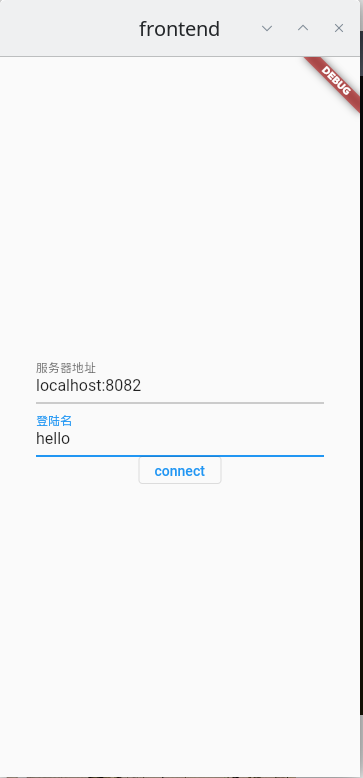
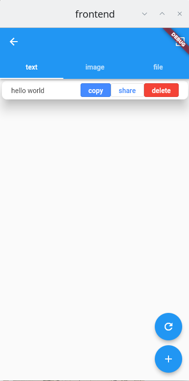
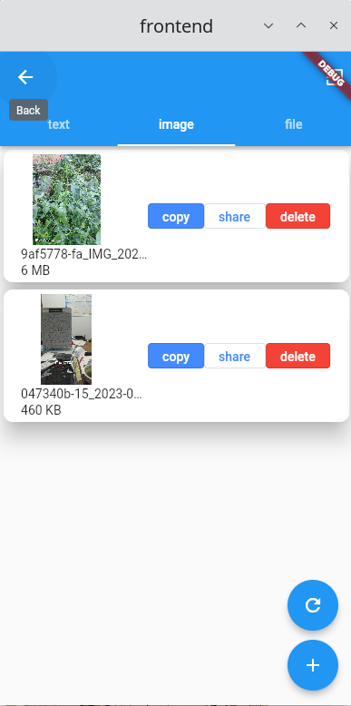
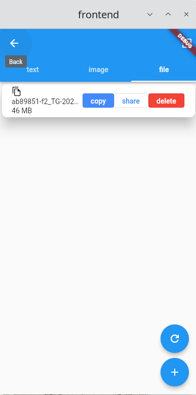
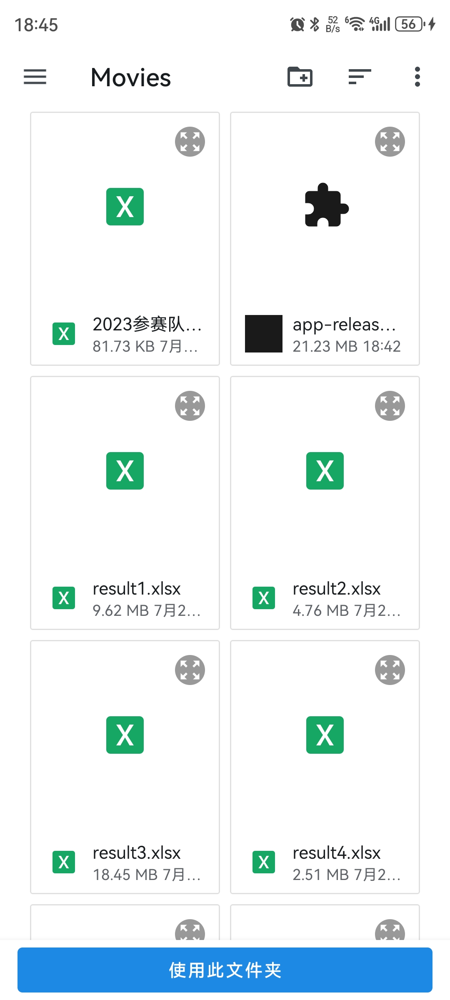
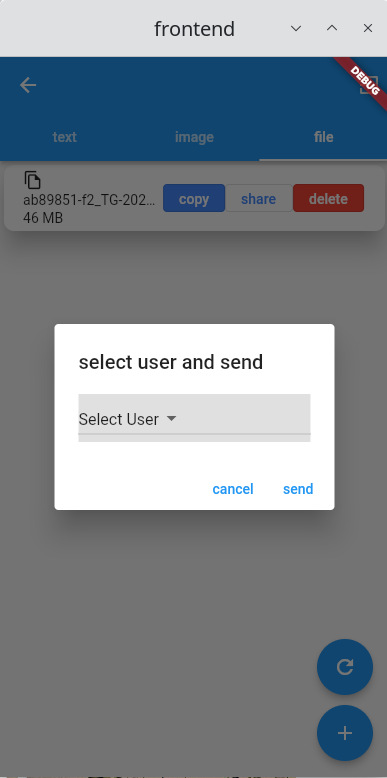
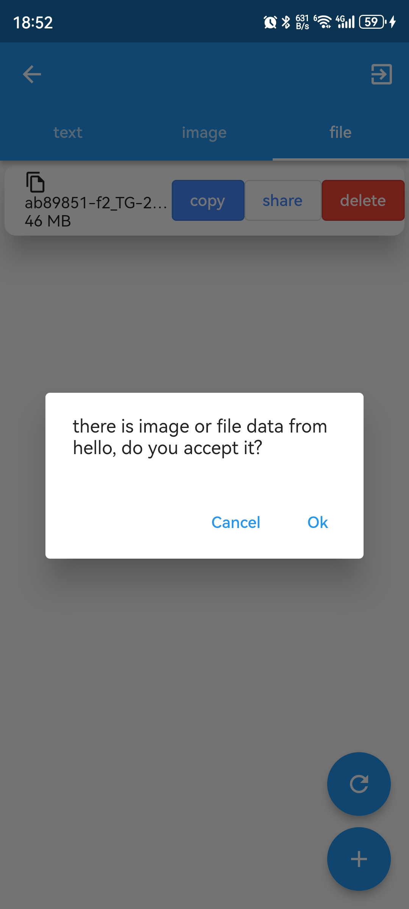

# Table of Contents

1.  [介绍](#orgd5f718f)
2.  [技术栈](#org6dc19e7)
    1.  [后端](#org5bf01d6)
    2.  [前端](#orgf935aac)
3.  [使用](#orgba2334d)
    1.  [连接服务器](#org2f9fdae)
    2.  [剪切板列表](#org363b3df)
    3.  [复制剪切板内容](#org421014a)
    4.  [分享剪切板内容](#orgb951071)
    5.  [上传剪切板内容](#orge068409)
4.  [To Install](#orgd4ba3d1)
    1.  [backend](#orge81849b)
    2.  [frontend](#orgf895454)
5.  [FIXME](#org443f656)
6.  [Feature](#orgcfb2281)

# 介绍

我平时的工作环境是 Linux + 手机，有时候我需要把文件从手机传到电脑，但是我发现在Linux的QQ无法使用 **我的文件**  
功能，这就很无语了  
这个时候就可以用到 KDE connect 了，通过他可以传递文件和剪切板  
但是，不知道为什么，在华为路由器下虽然能够ping到其他主机，但是 kde connect 连接到其他主机，我也不知道怎么回事  
于是我就想自己做一个 远程剪切板管理程序，这样就能有 kde connect 的部分功能了  
不过这个程序与 kde connect 不同的是，我这边有一个在后端运行的 springboot 程序，  
需要通过前端程序访问后端来实现剪切板管理，kde connect 是不需要后端的  

# 技术栈

## 后端

1.  springboot 3.0 + Kotlin
2.  PostgreSQL
3.  exposed-spring-boot-starter
4.  spring-boot-starter-validation
5.  spring-boot-starter-websocket
6.  protobuf-kotlin

## 前端

1.  Flutter
2.  pasteboard
3.  dio
4.  provider
5.  websocketchannel
6.  filepicker
7.  pathprovider
8.  path
9.  permissionhandler

# 使用

## 连接服务器

  

输入服务器地址(ip:port)，登陆名后，点击连接，即可进入剪切板管理  

## 剪切板列表

  

  

  

## 复制剪切板内容

点击 **copy** 按扭，在 Linux/Windows 平台下，  

-   文字内容会被复制到剪切板
-   图片/文件 内容也会被复制到剪切板

不过在 Android 平台下复制 图片/文件 内容时，flutter的 **filepicker** 没有实现 `saveFiles` 这个方法，  
所以需要手动设置保存的目录路径，才会把文件下载过来  

  

## 分享剪切板内容

  

点击 share 按扭，需要你选择发送的用户，然后点击 send  
此时对端会弹出一个对话框  

  

点击OK接收数据，如果目标是 Linux/Windows ，会将数据复制到目标剪切板  
如果目标是 Android/iOS， 需要你选择保存的目录路径  

## 上传剪切板内容

不管在哪个 tab 中，点击那个 + 按扭，他都能正确的知道你想要上传哪种类型的内容  

-   如果是 text ，他会弹出一个对话框，输入文字即可
-   如果是 image/file ，他会调用 `FilePicker.platform.pickFiles` ，弹出一个对话框让你选择文件

# To Install

## backend

在安装之前，别忘了在 `application.yaml` 里改配置  

    server:
      port: 8082
      address: 0.0.0.0
      servlet:
        context-path: /api
    
    spring:
      exposed:
        generate-ddl: true
      datasource:
        url: jdbc:postgresql://localhost/transfer-clipboard
        username: steiner
        password: 779151714
      servlet:
        multipart:
          max-file-size:
            100MB
          max-request-size:
            100MB
    
    
    
    file:
      storage:
        url: /home/steiner/disk/windows-data/Download/storage

不过服务端的端口和 `context-path` 我在前端里写死了，这两个就不要改了，要改的是  

1.  `datasource.url` 指定数据库地址
2.  `datasource.username` 指定数据库用户名
3.  `datasource.password` 指定数据库密码
4.  `file.storage.url` 指定文件上传路径

    cd backend
    ./gradlew build -x test
    java -jar build/libs/backend-0.0.1-SNAPSHOT.jar

## frontend

    cd frontend

    flutter create . --platform=platform-type

    flutter build --release

# FIXME

-   [X] on press copy image/file case windows + subfix
-   [X] online user is duplicate
-   [X] textfield too long
-   [X] empty file
-   [X] insert(0, element) not work
-   [X] touid setState
-   [X] 退出时黑屏
-   [X] 设置初始 size
-   [X] filecard overflow
-   [X] android saveFile not implement, snackbar to notify, set default save path
-   [ ] harmony os not work
-   [X] duplicate name

# Feature

-   [X] floating action button to add data
-   [ ] schedule : delete tempfile every 10 min
-   [X] Stream for refresh page, when update data, use websocke to send a message
-   [X] setting server url by manual
-   [X] handle connection lose exception
-   [X] handle error when connect
-   [X] show dialog for uploading file
-   [X] android icon

